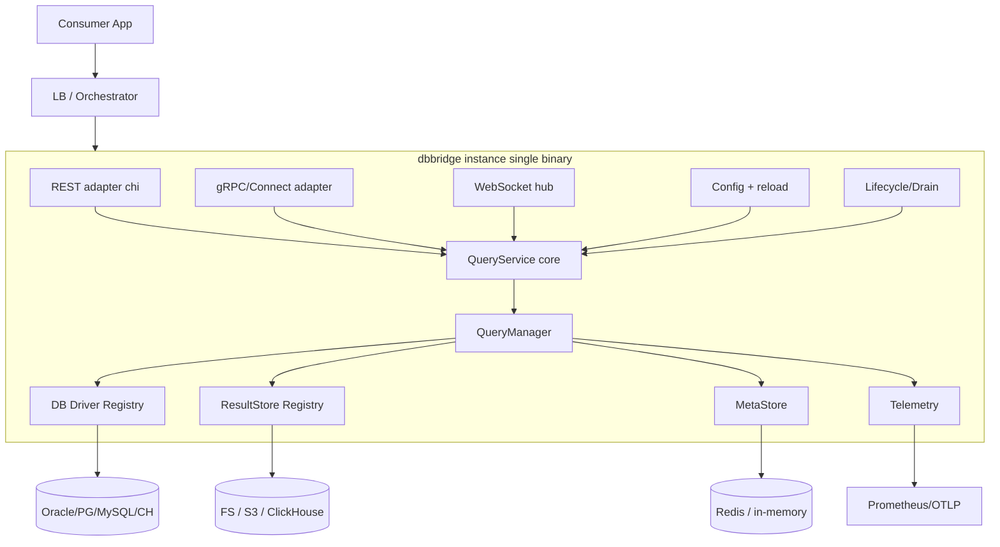
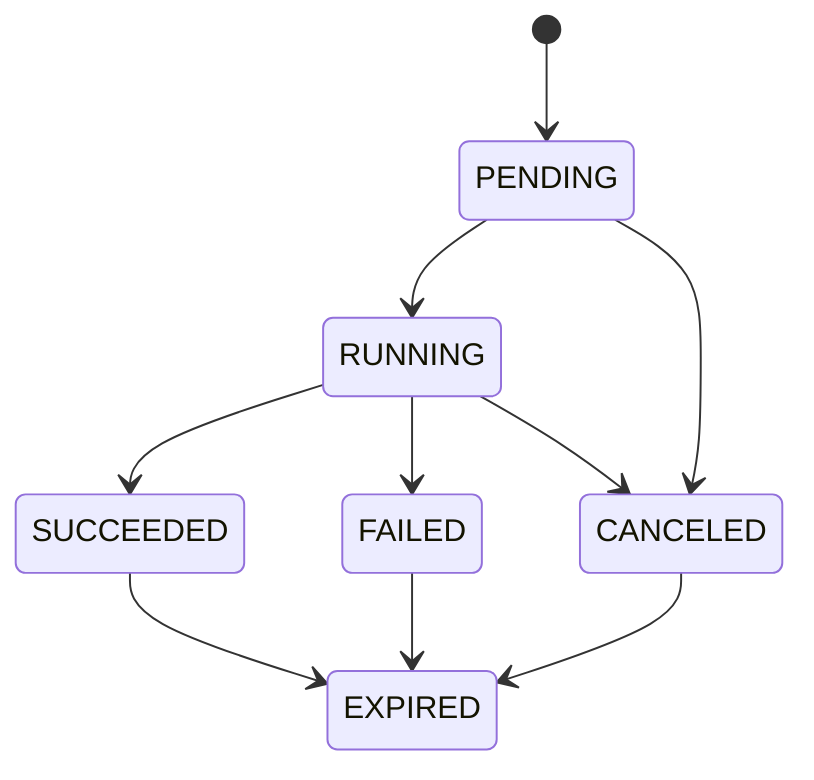

# dbbridge — Specification

## 1. Purpose and Key Invariants

`dbbridge` is an SQL proxy that accepts a query, executes it on the target database in the background, and survives a restart of the **consumer**. The consumer receives a `query_id` and subsequently polls the status or downloads the result using it.

Invariants (mandatory to adhere to across all layers):
- **I1. The query lifecycle is NOT bound to the incoming connection.** The execution context is derived from `context.Background()` + timeout options, NOT from the `ctx` of the HTTP/gRPC request. Disconnecting the consumer does not cancel the query.
- **I2. Any instance can handle read requests** (status/stats/download/list) — metadata is stored in Redis, and results are stored in shared storage. Write/execution belongs to a single owner instance (`owner_instance_id`).
- **I3. Idempotency:** repeating `StartQuery` with the same key within the retention window returns the same `query_id` and does not trigger a second execution.
- **I4. Results are materialized exactly once** (stream+persist during execution); download always reads from storage, and the database is not queried again.
- **I5. Graceful drain:** an instance returns `can_be_stopped=true` only when it has 0 in-flight owned queries.

Out of scope for v1 (design interfaces, implement in v2): restarting the proxy itself without stopping its queries (split gateway/executor + FD-handoff variant).

## 2. Architecture (v1: single binary, layer by layer)


```mermaid
flowchart TB
  consumer[Consumer App] --> lb[LB / Orchestrator]
  lb --> inst[dbbridge instance]
  subgraph inst [dbbridge instance single binary]
    rest[REST adapter chi] --> svc
    grpc[gRPC/Connect adapter] --> svc
    ws[WebSocket hub] --> svc
    svc[QueryService core] --> qm[QueryManager]
    qm --> drv[DB Driver Registry]
    qm --> store[ResultStore Registry]
    qm --> meta[MetaStore]
    qm --> tel[Telemetry]
    cfg[Config + reload] --> svc
    life[Lifecycle/Drain] --> svc
  end
  drv --> dbs[(Oracle/PG/MySQL/CH)]
  store --> backends[(FS / S3 / ClickHouse)]
  meta --> redis[(Redis / in-memory)]
  tel --> prom[Prometheus/OTLP]
```

Layers are strictly separated by interfaces, so that in v2 `QueryManager` can be moved to a separate durable daemon without rewriting the transports.

## 3. Query State Machine


```mermaid
stateDiagram-v2
  [*] --> PENDING
  PENDING --> RUNNING
  RUNNING --> SUCCEEDED
  RUNNING --> FAILED
  RUNNING --> CANCELED
  PENDING --> CANCELED
  SUCCEEDED --> EXPIRED
  FAILED --> EXPIRED
  CANCELED --> EXPIRED
```
- `RUNNING` includes streaming→persisting sub-phases (visible in stats).
- `EXPIRED` — after `result_ttl` expires, a background GC cleans up storage + metadata.
- If the owner dies (lease expires) and the query is in `RUNNING` — transition to `FAILED` (reason=`owner_lost`) in v1.

## 4. Domain Data Structures (`internal/core/domain`)

- `QueryOptions`: `Timeout time.Duration` (0 = no limit, default), `Mode` (`async` default | `sync`), `ResultTTL time.Duration` (default 24h), `IdempotencyKey string`, `ResultFormat` (`jsonl` default | `csv` | `parquet`), `StorageBackend string` (default override). Options are validated against these sets before any side effect: `ResultFormat` reaches the filesystem as part of a file name, so an unvalidated value is a path traversal.
- `QueryRecord`: `ID`, `DatabaseID`, `SQL`, `Options`, `State`, `OwnerInstanceID`, `CreatedAt/StartedAt/FinishedAt`, `Error *QueryError`, `Stats QueryStats`, `Result *ResultRef`, `IdempotencyKey`, `LeaseDeadline`, `Subject`. `LeaseDeadline` is derived from the owner's lease key, not stored in the record: a heartbeat that rewrote the record would overwrite a concurrent terminal write.
- `QueryStats`: `RowsRead`, `BytesWritten`, `DBExecDuration`, `StorageWriteDuration`, `TotalDuration`, `Retries`.
- `ResultRef`: `Backend string`, `Locator string` (path/key/table), `SizeBytes`, `RowCount`, `Format`, `Checksum`.
- `DatabaseInfo`: `ID`, `Engine` (oracle|postgres|mysql|clickhouse), `DisplayName`, `Healthy bool`.
- `QueryError`: `Code` (enum), `Message`, `Retryable bool`.

## 5. Module Contracts (Interfaces)

### 5.1 QueryService (`internal/core/service`) — transport-agnostic facade
A single interface called by ALL three transports:
- `StartQuery(ctx, dbID, sql, opts) (QueryRecord, error)` — I1: decouples context internally.
- `GetStatus(ctx, id) (QueryRecord, error)` — returns record with all options.
- `StopQuery(ctx, id) error` — cancels locally or forwards to the owner (5.5).
- `GetStats(ctx, id) (QueryStats, error)`.
- `OpenResult(ctx, id) (io.ReadCloser, ResultRef, error)` — stream from storage.
- `ListDatabases(ctx) ([]DatabaseInfo, error)`.
- `ReloadConfig(ctx) (ReloadReport, error)`.
- `Watch(ctx, id) (<-chan QueryEvent, error)` — for WS/streams.

### 5.2 DB Driver plugin (`internal/db`)
Registry based on compile-time registration (NOT Go `plugin`):
- `type Driver interface { Open(ctx, DSNConfig) (Pool, error) }`
- `type Pool interface { Exec(ctx, sql) (RowStream, error); Ping(ctx) error; Close() error; Stats() PoolStats }`
- `type RowStream interface { Columns() []ColumnMeta; Next() bool; Scan(dest...) / Row() []any; Err() error; Close() error }`
- `func Register(engine string, d Driver)` + `init()` in each driver.
- Drivers: `postgres` (jackc/pgx), `mysql` (go-sql-driver/mysql), `clickhouse` (clickhouse-go/v2), `oracle` (godror or sijms/go-ora). Each returns a stream so that large results are not kept in memory.

### 5.3 ResultStore plugin (`internal/storage`)
- `type ResultStore interface { Writer(ctx, ResultRef) (io.WriteCloser, error); Reader(ctx, ResultRef) (io.ReadCloser, error); Stat(ctx, ResultRef) (ResultRef, error); Delete(ctx, ResultRef) error }`
- `func Register(name string, factory Factory)` + `init()`.
- Backends: `fs` (local FS/NFS), `s3` (aws-sdk-go-v2, multipart upload for large files), `clickhouse` (writing results to a system table). Backend selection is from config (default) with override in `QueryOptions`.

### 5.4 MetaStore (`internal/state`)
- `type MetaStore interface { PutQuery / GetQuery / UpdateQuery / UpdateQueryIfState / ListByInstance / ListDatabasesSeen; AcquireIdempotency(ctx, dbID, key, queryID, ttl) (existing string, acquired bool, err error); ReleaseIdempotency / RefreshIdempotency; Heartbeat(ctx, instanceID, queries []string, ttl) error; TryLock(ctx, name, ttl) (bool, error); PublishControl(ctx, ControlMsg) error; SubscribeControl(ctx) (<-chan ControlMsg, error); CountInFlight(ctx, instanceID) (int, error); ListExpiredQueries / ListStaleQueries / DeleteQuery / Close }`
- `UpdateQueryIfState` is the fencing primitive: a reaper or a late writer must not resurrect a query that has already reached a terminal state. `TryLock` keeps cluster-wide periodic work (GC) on one instance at a time.
- Implementations: `redis` (go-redis/v9; idempotency via `SET NX`, lease via per-query TTL keys refreshed by the heartbeat, control and query events via Pub/Sub, conditional writes via `WATCH`/`MULTI`) and `memory` (in-process, for single-node installations — without cross-instance capabilities).

### 5.5 Cross-instance control
`StopQuery`/reload-config for a query owned by another instance: `QueryService` checks `OwnerInstanceID`; if not local — `MetaStore.PublishControl({type: stop, query_id})`; the owner cancels the local `context.CancelFunc` from the active query registry via `SubscribeControl`.

Query events travel the same channel (`{type: query_event, ...}`). Watchers are a per-process map, so without publishing them a subscription opened through any instance other than the owner would never fire, which breaks I2 for WebSocket and `WatchQuery`. An instance ignores its own announcements, and publishing runs off the execution path so it can never stall a query.

## 6. QueryManager (`internal/core/manager`) — Execution Core

`StartQuery` Algorithm:
1. Validate `dbID` against the current config snapshot.
2. If idempotency key is set → `AcquireIdempotency`; if occupied — return the existing `QueryRecord`.
3. Create `QueryRecord{State: PENDING, OwnerInstanceID: self}`, `PutQuery`.
4. Register `cancel` in the local `activeRegistry[id]`.
5. **I1:** `execCtx := context.WithTimeout(context.Background(), opts.Timeout)` (or without timeout).
6. Launch goroutine `run(execCtx, record)`: `Pool.Exec` → `RowStream` → format encoder → `ResultStore.Writer` (stream+persist, I4), increment stats, update state in MetaStore.
7. `async`: immediately return record with `query_id`. `sync`: wait for completion/timeout and return the final record (but execution is still decoupled — continues if connection drops).
8. Heartbeat ticker updates owner lease and in-flight list.

GC Worker: periodically searches for `EXPIRED`/outdated queries by `ResultTTL`, cleans up storage + metadata.

## 7. Transports (`internal/transport`)

The API contract is defined spec-first: a single proto file `api/proto/dbbridge/v1/dbbridge.proto` + OpenAPI for REST.

- **gRPC + Connect** (`connectrpc.com/connect`, buf generation) — methods: `StartQuery`, `GetQueryStatus`, `StopQuery`, `GetQueryStats`, `DownloadResult` (server-stream), `ListDatabases`, `ReloadConfig`, `CanIBeStopped`, `WatchQuery` (server-stream). Provides gRPC + gRPC-Web + Connect/JSON from a single service.
- **REST** (`go-chi/chi`, thin adapter to the same `QueryService`):
  - `POST /v1/queries` (body: db_id, sql, options; header `Idempotency-Key`) → 202 + query_id.
  - `GET /v1/queries/{id}` → status + all options.
  - `POST /v1/queries/{id}:stop`.
  - `GET /v1/queries/{id}/stats`.
  - `GET /v1/queries/{id}/result` → result stream (chunked, `Range` optional).
  - `GET /v1/databases`.
  - `POST /v1/admin/reload`.
  - `GET /v1/admin/can-stop` → `{can_be_stopped, in_flight}` for orchestrator.
  - `GET /healthz` (liveness, always 200), `GET /readyz` (readiness — 503 while draining, see §10), `GET /metrics`.
- **WebSocket** (`coder/websocket`, `/v1/ws`): subscription to `QueryEvent` (state changes, progress) via `QueryService.Watch`.

All adapters are without business logic, only mapping DTO↔domain.

## 8. Configuration (`internal/config`)

YAML, hot-reload via endpoint `/v1/admin/reload` + `SIGHUP` (+ optional fsnotify). Atomic snapshot swap via `atomic.Pointer[Config]`; on reload: add new DB pools, drain removed ones, update modified ones. A pool is reused only when its engine, DSN and `max_conns` are unchanged; a replaced or removed pool is closed after the queries using it finish, not immediately.

Any `${VAR}` in the file is substituted from the environment at load time, and an unset variable is a load error. That is how credentials stay out of the config file and how each replica gets a distinct `instance.id`. A bare `$VAR` is left alone, so DSNs and passwords may contain a dollar sign.

**Reload scope.** `instance.*`, `server.*`, `storage.*`, `auth.*` and `defaults.max_concurrent_queries` are read once at startup: the instance ID is captured by `QueryManager`, the MetaStore and the storage backends are built in `main`, the listeners are bound once, the `Authenticator` is built once - so revoking a token takes a restart - and the concurrency semaphore is sized once. A reload reports them in `ReloadReport.Ignored` rather than claiming success and quietly keeping the old values; databases that failed to open appear in `ReloadReport.Failures`. Draft:

```yaml
instance:
  id: dbbridge-blue
  metastore: redis   # redis | memory
  redis: { addr: "redis:6379" }
  default_storage: s3
server:
  rest_addr: ":8080"
  grpc_addr: ":9090"
defaults:
  result_ttl: 24h
  query_timeout: 0
storage:
  s3: { bucket: dbbridge, region: eu-central-1 }
  fs: { root: /var/lib/dbbridge/results }
  clickhouse: { dsn: "...", table: dbbridge_results }
databases:
  - id: pg_main
    engine: postgres
    dsn: "postgres://..."
    pool: { max_conns: 20 }
  - id: ora_billing
    engine: oracle
    dsn: "oracle://..."
```

## 9. Security

The API executes SQL under the service credentials of every configured
database, so its perimeter is part of the specification rather than a
deployment detail.

**Authentication.** Credentials are configured, not mandatory: with an `auth`
section present, every `/v1` route and every gRPC procedure requires one, and
with the section absent the API is open and the process says so at startup with
`WARNING: no auth tokens configured`. v1 uses static bearer tokens declared in
`auth.tokens`, each with a `subject` and a set of `scopes`; the value is
normally read from an environment variable (`value_env`) so it never lives in
the config file. Tokens are compared in constant time. `GET /healthz` and
`GET /readyz` are exempt; `GET /metrics` is not, because its labels enumerate
every configured `db_id`. An `auth` section that resolves to no usable token is
a startup failure: coming up with the API open while the operator believes it is
protected is worse than not starting. `auth` is not reloadable - it is reported
under `report.ignored` - so revoking a token takes a restart.

**Authorization.** Scopes are `read` (status, stats, download, list, watch),
`write` (start, stop) and `admin` (reload, can-stop, `/metrics`); `write`
implies `read`, and `admin` implies both. The `/v1` subtree denies by default,
so a route added without a gate is still not reachable without a credential. Every `QueryRecord` carries the `Subject` that submitted it, and the
read paths refuse a record belonging to another subject — knowing a `query_id`
must not be enough to read someone else's SQL or result. A foreign query
answers `404`, not `403`, so the API does not confirm that an ID exists.
`admin` acts across subjects. A record with an empty subject predates subject
binding and is reachable only with `admin`.

**Statement policy.** Only read-only statements are accepted. The guard
tokenizes the statement — comments, string literals, quoted identifiers and
dollar quoting are consumed as such — then requires a single statement starting
with a read verb and containing no write keyword. It is defence in depth, not a
substitute for a target database user that holds only read privileges;
`defaults.allow_writes` turns it off explicitly.

**Transport.** `server.tls.{cert_file,key_file}` serves REST, gRPC and the
admin listener over TLS. Without a certificate gRPC falls back to cleartext
HTTP/2, which has to be acknowledged with `server.tls.allow_h2c`.
The certificate pair is re-read when it changes on disk, so a renewal does not
wait for a restart. `X-Forwarded-For` is only honoured for
`server.trusted_proxy_count` hops; with none configured the header is not
trusted at all. A WebSocket upgrade is
refused unless its `Origin` is listed in `server.ws_allowed_origins`, empty
meaning same-origin only; because a browser cannot set request headers on a
handshake, the credential may also be offered as the subprotocol pair
`["dbbridge.bearer", token]`.

**Limits.** `server.max_request_bytes` caps a request body,
`defaults.max_concurrent_queries` caps concurrent executions per instance and
`server.rate_limit` caps the request rate of a single caller — keyed by
authenticated subject, or by client address before an identity is known; they
reject with `413`, `429` and `429` respectively. `ReadHeaderTimeout` and
`IdleTimeout` bound connections that open and then stall. `ReadTimeout` and
`WriteTimeout` are deliberately unset: they would cut off result downloads and
WebSocket connections. A WebSocket connection holds at most 32 subscriptions.

**Isolation.** `server.admin_addr` moves `/metrics` and `/v1/admin/*` to their
own listener: the metric labels enumerate every configured `db_id` and the
admin routes reload the process. Result locators come from the MetaStore, which
is a separate trust domain, so the `fs` backend confines every operation to its
root through `os.Root` and the `s3` backend confines keys to its result prefix.

**Errors.** Responses carry a category and, for input errors, a reason —
never a wrapped driver error, which spells out the host, the user and the
connection parameters. The full text goes to the log, keyed by request ID.

## 10. Lifecycle and Blue/Green (`internal/lifecycle`)

- Instance states: `SERVING` → `DRAINING` → `STOPPABLE`. On SIGTERM → `DRAINING`: new `StartQuery` requests are rejected (503), `CanIBeStopped` starts depending on `CountInFlight`.
- `CanIBeStopped` (REST + gRPC): `true` ⟺ in-flight owned queries = 0 (I5). Orchestrator polls before stopping the blue instance.
- **Readiness gating via `/readyz`:** `GET /readyz` returns `200` while `SERVING` and `503` while `DRAINING`, so the LB / Kubernetes readiness probe takes the node out of rotation and stops routing new traffic the moment draining begins (in-flight owned queries keep running to completion). This is complementary to `CanIBeStopped`, not redundant: `/readyz` gates *incoming traffic*, whereas `CanIBeStopped` / `GET /v1/admin/can-stop` signals when the node has fully quiesced and is *safe to terminate* (0 in-flight, I5). `GET /healthz` is a pure liveness check (always `200`) and must not depend on external systems.
- Two instances (`dbbridge-blue`/`dbbridge-green`) behind LB, shared Redis + storage; reads are served by any instance, drain is done one by one.

## 11. Telemetry (`internal/telemetry`)

OpenTelemetry SDK (metrics+traces), Prometheus exporter on `/metrics`, OTLP export. Go metrics via `runtime/metrics` (`otel` runtime instrumentation). Domain metrics: `dbbridge_queries_total{engine,state}`, `dbbridge_query_duration_seconds`, `dbbridge_inflight_queries`, `dbbridge_result_bytes_total{backend}`, `dbbridge_db_pool_*`, `dbbridge_idempotency_hits_total`. End-to-end tracing: transport → service → manager → driver/store.

## 12. Repository Structure

```
dbbridge/
  cmd/dbbridge/main.go
  api/proto/dbbridge/v1/dbbridge.proto
  api/openapi/dbbridge.yaml
  internal/authn/
  internal/config/
  internal/core/{domain,service,manager}/
  internal/core/idempotency/
  internal/db/{registry.go, drivers/{postgres,mysql,oracle,clickhouse}}/
  internal/sqlguard/
  internal/storage/{registry.go, backends/{fs,s3,clickhouse}}/
  internal/state/{redis,memory}/
  internal/transport/{rest,grpcconnect,ws}/
  internal/telemetry/
  internal/lifecycle/
  configs/dbbridge.yaml
  deploy/{docker-compose.yaml, Dockerfile, k8s/}
  test/{e2e,integration}/
  go.mod (go 1.26)
```

## 13. Stack

Go 1.26; `connectrpc.com/connect` + buf; `go-chi/chi`; `coder/websocket`; `redis/go-redis/v9`; `jackc/pgx/v5`, `go-sql-driver/mysql`, `ClickHouse/clickhouse-go/v2`, `godror` (or `sijms/go-ora`); `aws/aws-sdk-go-v2`; `go.opentelemetry.io/otel` + prometheus exporter; `spf13/viper` or `knadh/koanf` for config; `testcontainers-go` for integration tests.

## 14. Implementation Order (Phases)

Phases are ordered by dependencies; see todos. Each phase ends with compilable code and tests. Core uses unit tests with fake registries; `test/integration` runs the real backends (Redis, PostgreSQL, MySQL, MinIO) under testcontainers behind the `integration` build tag, as a separate CI job.

## 15. Code Conventions

No trailing spaces; each file ends with an empty line; `go vet`, `golangci-lint`, `gofmt`, `buf lint` and `govulncheck` in CI; domain errors via `errors.AsType` (Go 1.26).
